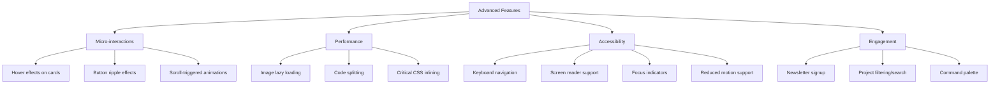

# Portfolio Enhancement Plan - Professional Upgrade

## Executive Summary

Your portfolio website already has a solid foundation with modern features like:
- Particle background effects
- Custom cursor
- Animated sections
- Dark theme with cyan/magenta accents
- Multi-language support (i18n)
- Documentation pages for Discord bots

However, there are several opportunities to make it **more professional and advanced**. This plan outlines specific enhancements across UI/UX, features, and content.

---

## Current Strengths

1. **Visual Effects**: Particle background, custom cursor, tilt cards, scroll progress
2. **Animations**: Page transitions, animated sections, smooth scrolling
3. **Components**: GitHub stats, testimonials, timeline, skills section
4. **Technical**: Service worker, theme toggle, i18n translations
5. **Content**: Documentation for 3 Discord bot projects

---

## Areas for Improvement

### 1. Navigation & UX Issues

**Current Problems:**
- Sidebar has inconsistent styling (magenta text on "ALL DOCUMENTATION")
- Missing active state indicators for navigation
- No breadcrumb navigation for documentation pages
- Mobile navigation not optimized

**Recommendations:**
- Fix sidebar color consistency
- Add active navigation states
- Implement breadcrumbs for docs
- Create mobile hamburger menu with smooth animations

### 2. Missing Professional Features

| Feature | Priority | Impact |
|---------|----------|--------|
| Favicon & PWA manifest | High | Branding, installability |
| SEO meta tags & structured data | High | Search visibility |
| Loading states & skeletons | Medium | Perceived performance |
| Error boundaries | Medium | Stability |
| Analytics integration | Medium | Insights |
| Contact form with validation | High | Professionalism |
| Resume/CV download | High | Accessibility |

### 3. Content Enhancements

**Projects Section:**
- Add live demo links for each project
- Include technology stack tags with icons
- Add project statistics (stars, forks, downloads)
- Create project detail pages with:
  - Screenshots/gallery
  - Feature lists
  - Architecture diagrams
  - Installation guides

**About Section:**
- Add professional photo/avatar
- Include downloadable resume
- Add certifications section
- Show GitHub contribution graph
- Display coding activity (WakaTime integration)

**New Pages to Consider:**
- `/blog` - Technical articles showcase
- `/achievements` - Certificates, awards, milestones
- `/uses` - Developer setup/tools (popular among devs)

### 4. Advanced UI/UX Features



### 5. Technical Improvements

**Performance:**
- Implement proper image optimization
- Add lazy loading for below-fold content
- Optimize particle background for mobile
- Add Core Web Vitals monitoring

**Code Quality:**
- Add TypeScript for type safety
- Implement proper error boundaries
- Add unit tests with Jest/Vitest
- Set up ESLint + Prettier consistently

---

## Recommended Implementation Phases

### Phase 1: Foundation (Critical)
- [ ] Fix sidebar navigation styling
- [ ] Add favicon and PWA manifest
- [ ] Implement SEO meta tags
- [ ] Add proper loading states
- [ ] Fix mobile responsiveness

### Phase 2: Content & Features
- [ ] Enhance Projects page with live demos
- [ ] Add project detail pages
- [ ] Create contact form with validation
- [ ] Add resume download
- [ ] Implement blog section

### Phase 3: Polish & Advanced
- [ ] Add command palette (Cmd+K)
- [ ] Implement view transitions API
- [ ] Add analytics dashboard
- [ ] Create achievements page
- [ ] Add advanced animations

---

## Specific Component Recommendations

### 1. Hero Section Enhancement
```jsx
// Add typing animation for role description
// Add floating tech stack icons
// Add scroll indicator with bounce animation
// Add social proof (GitHub stars, etc.)
```

### 2. Projects Showcase
```jsx
// Add filter by technology
// Add search functionality
// Add "View Code" and "Live Demo" buttons
// Add project status badges (Active, Archived, etc.)
```

### 3. Skills Section
```jsx
// Add skill level indicators (progress bars)
// Add category grouping
// Add proficiency percentages
// Add "Learning" vs "Mastered" distinction
```

### 4. Contact Section
```jsx
// Add form validation with error messages
// Add success/error toast notifications
// Add social media links with hover effects
// Add location map (optional)
```

---

## Design System Recommendations

### Color Palette Refinement
- Primary: Cyan (`#00d4ff`) - Keep
- Secondary: Magenta (`#ff00ff`) - Use sparingly
- Background: Dark (`#0a0a0a`) - Keep
- Surface: Slightly lighter (`#1a1a1a`)
- Text: White with opacity variations

### Typography
- Add a secondary font for headings (Inter, Poppins)
- Improve line-height for readability
- Add font-weight variations

### Spacing & Layout
- Implement consistent spacing scale
- Add container max-width constraints
- Improve grid layouts

---

## New Project Ideas to Showcase

1. **AI Chat Interface** - Modern chat UI with streaming responses
2. **Dashboard Analytics** - Data visualization with charts
3. **E-commerce Frontend** - Product catalog, cart, checkout
4. **Real-time Collaboration Tool** - WebSockets, live cursors
5. **Portfolio CMS** - Content management for your own portfolio
6. **Discord Bot Dashboard** - Web interface for your bots

---

## Quick Wins (Can Implement Immediately)

1. ✅ Fix sidebar magenta text color
2. ✅ Add favicon using RealFaviconGenerator
3. ✅ Add meta description tags
4. ✅ Add Open Graph tags for social sharing
5. ✅ Add loading spinner component
6. ✅ Improve button hover states
7. ✅ Add "Back to Top" button
8. ✅ Add 404 error page

---

## Success Metrics

After implementation, your portfolio should have:
- [ ] Lighthouse score > 90 (Performance, Accessibility, SEO)
- [ ] Mobile-friendly design
- [ ] Professional favicon and branding
- [ ] Working contact form
- [ ] At least 5 showcased projects
- [ ] Complete documentation
- [ ] Fast load times (< 3s)

---

## Next Steps

1. Review this plan and prioritize features
2. Decide which phases to implement
3. Approve the plan for implementation
4. Switch to Code mode to begin development

Would you like me to proceed with implementing any of these enhancements? I recommend starting with Phase 1 (Foundation) for immediate impact.
